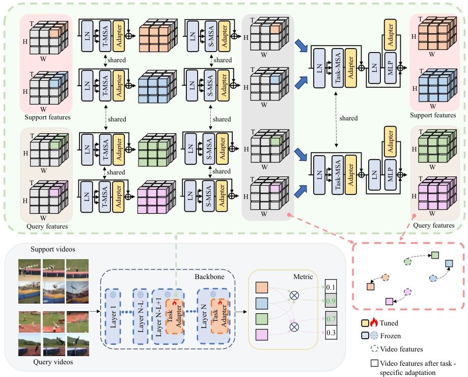

# Task-Adapter: Task-specific Adaptation of Image Models for Few-shot Action Recognition (ACM MM2024)

This repo contains code for the method introduced in the paper:
[Task-Adapter: Task-specific Adaptation of Image Models for Few-shot Action Recognition](https://arxiv.org/abs/2408.00249)

Code will be released soon.
