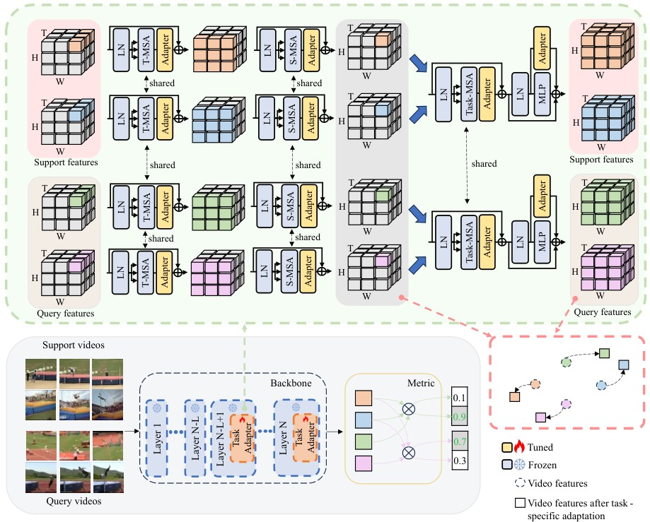

# Task-Adapter: Task-specific Adaptation of Image Models for Few-shot Action Recognition (ACM MM2024)

This repo contains code for the method introduced in the paper:
[Task-Adapter: Task-specific Adaptation of Image Models for Few-shot Action Recognition](https://arxiv.org/abs/2408.00249)




## Data Preparation
We prepare the dataset according to [FSL-Video](https://github.com/MCG-NJU/FSL-Video) and [TAM](https://github.com/liu-zhy/temporal-adaptive-module).

Specifically, the steps to prepare the dataset are summarized as follows:
- Downloading the few shot version of video dataset. [Download links](https://box.nju.edu.cn/d/dc97163752fc4024be2c/) for Kinetics and SSv2 has been provided by [FSL-Video](https://github.com/MCG-NJU/FSL-Video). We additionally provide [download links](https://drive.google.com/drive/folders/174O2ubnzHb9wtEmLfMsnP_Vbcslm_-Vx?usp=sharing) for UCF101 and HMDB51.

  Note that these datasets has been pre-processed (All the categories have been sorted according to the standard FSAR train, val and test splits) and are organized with the following structure:
    ```
  datasets
  |_ Kinetics
    |_ class0
    |_ |_ [video_0]
    |_ |_ [video_1]
    |_ |_ ...
    |_ class1   
    |_ |_ [video_0]
    |_ |_ [video_1]
    |_ |_ ...
  ```

- Extract video frames by running:
  ```
  python tools/extract_frames.py VIDEOS_PATH/ \
  -o DATASETS_PATH/frames/ \
  -j 16 --out_ext png
  ```
- Generate annotations by running:
  ```
  python tools/annotations_[DATASET].py
  ```
  The annotation usually includes train.txt, val.txt and test.txt (optional). The format of *.txt file is like:
  ```
  frames/video_1 num_frames label_1
  frames/video_2 num_frames label_2
  frames/video_3 num_frames label_3
  ...
  frames/video_N num_frames label_N
  ```

  The final datasets are organized with the following structure:

  ```
  datasets
  |_ Kinetics
    |_ frames
    |  |_ [video_0]
    |  |  |_ img_00001.png
    |  |  |_ img_00001.png
    |  |  |_ ...
    |  |_ [video_1]
    |     |_ img_00001.png
    |     |_ img_00002.png
    |     |_ ...
    |_ annotations
       |_ train.txt
       |_ val.txt
       |_ test.txt 
   
  ```
## Running Example

Compared with scene related datesets (e.g., UCF101, Kinetics, HMDB51), SSv2 needs more training epochs to learn temporal modeling.

- For the scene related datesets(eg., UCF101, Kinetics, HMDB51):
  
  Take UCF101 for example(other default hyperparameters please refer to utils.py):
  ``` 
  python run.py --dataset ucf101 --method taskadapter --n_shot 1 --train_episode 200 --stop_epoch 10
  ```
- For SSv2 OTAM :
  ```
  python run.py --dataset somethingotam --method taskadapter --n_shot 1 --train_episode 1000 --stop_epoch 50
  ```
- For SSv2 CMN :
  ```
  python run.py --dataset somethingcmn --method taskadapter --n_shot 1 --train_episode 1000 --stop_epoch 20
  ```


## Citation
If you find our code useful, please consider citing our work using the bibtex:
```
@inproceedings{cao2024task,
  title={Task-Adapter: Task-specific Adaptation of Image Models for Few-shot Action Recognition},
  author={Cao, Congqi and Zhang, Yueran and Yu, Yating and Lv, Qinyi and Min, Lingtong and Zhang, Yanning},
  booktitle={Proceedings of the 32nd ACM International Conference on Multimedia},
  pages={9038--9047},
  year={2024}
}
```

# References

Our project builds upon several existing publicly available code. Specifically, we have modified and integrated the following code into this project:
- [https://github.com/MCG-NJU/FSL-Video](https://github.com/MCG-NJU/FSL-Video)
- [https://github.com/wyharveychen/CloserLookFewShot](https://github.com/wyharveychen/CloserLookFewShot)
- [https://github.com/liu-zhy/temporal-adaptive-module](https://github.com/liu-zhy/temporal-adaptive-module)
- [https://github.com/linziyi96/st-adapter](https://github.com/linziyi96/st-adapter)
- [https://github.com/taoyang1122/adapt-image-models](https://github.com/taoyang1122/adapt-image-models)
- [https://github.com/alibaba-mmai-research/CLIP-FSAR](https://github.com/alibaba-mmai-research/CLIP-FSAR)